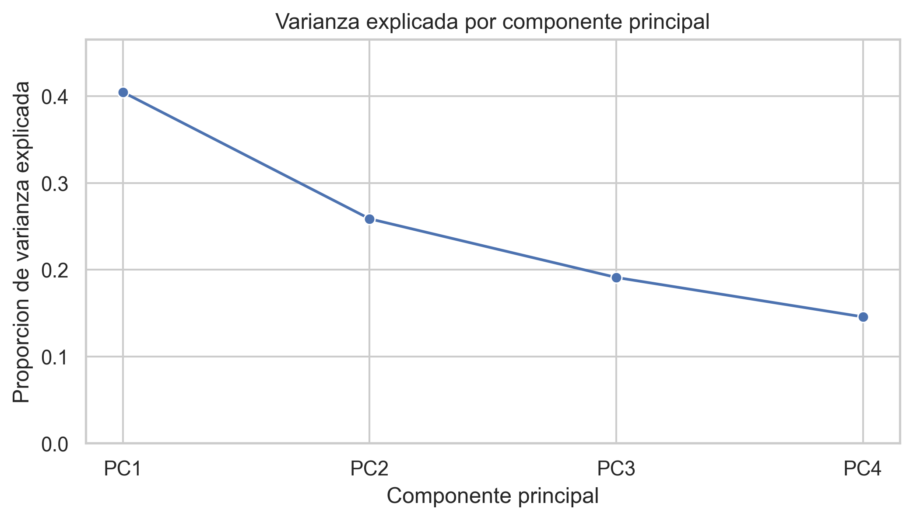
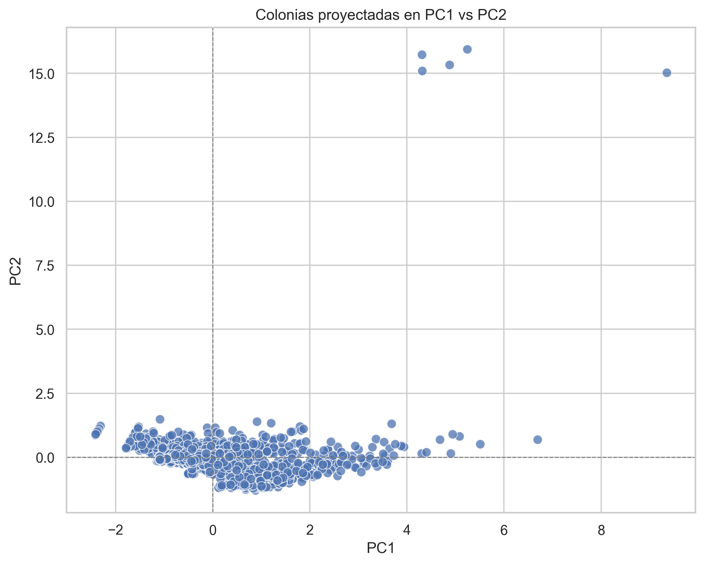
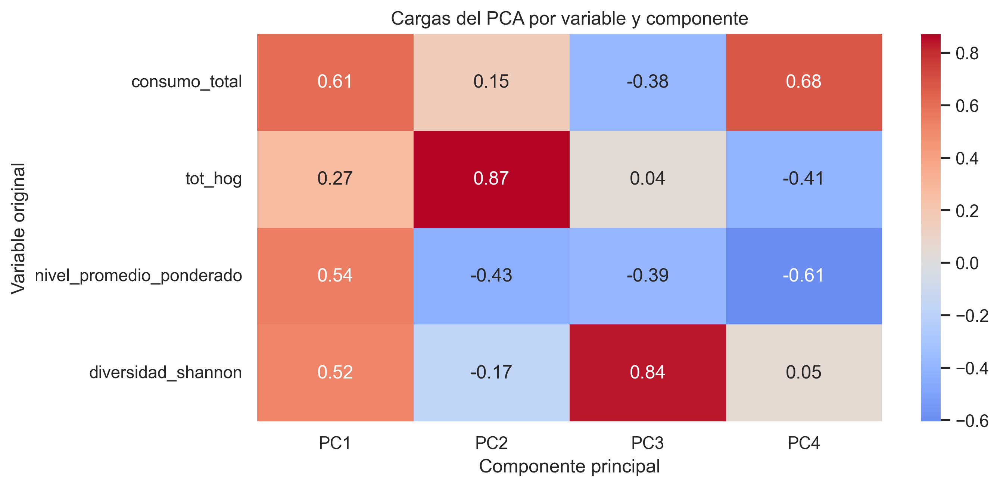
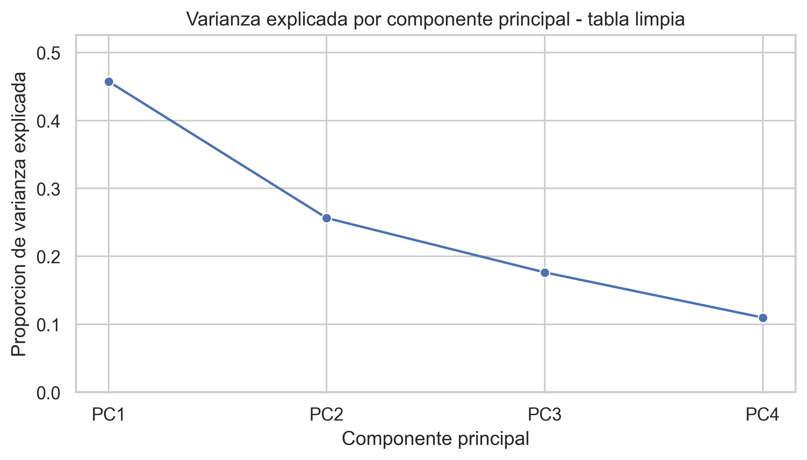
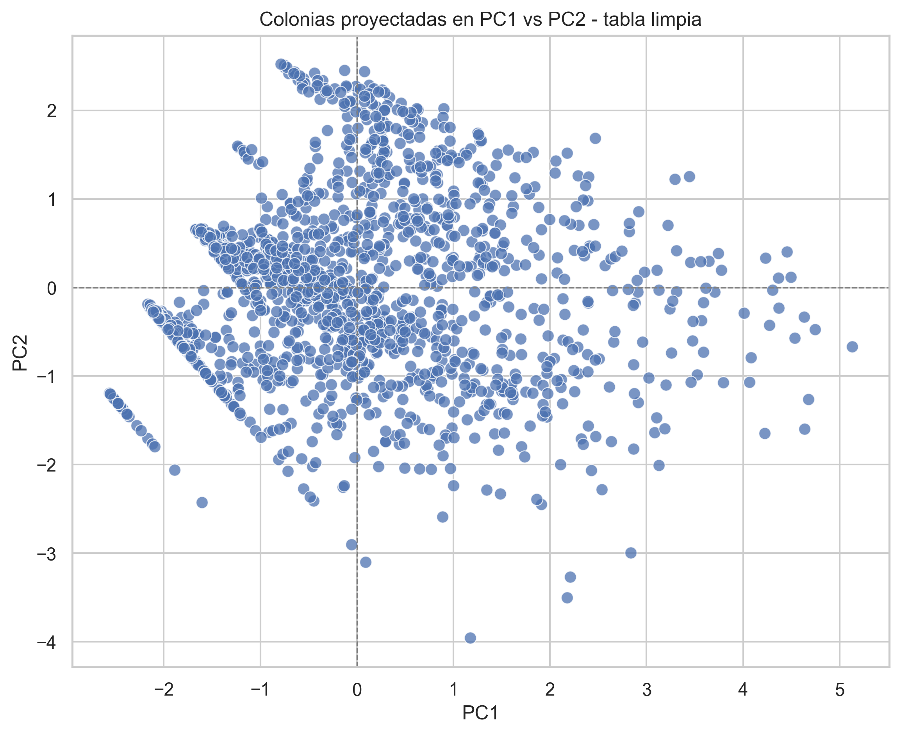
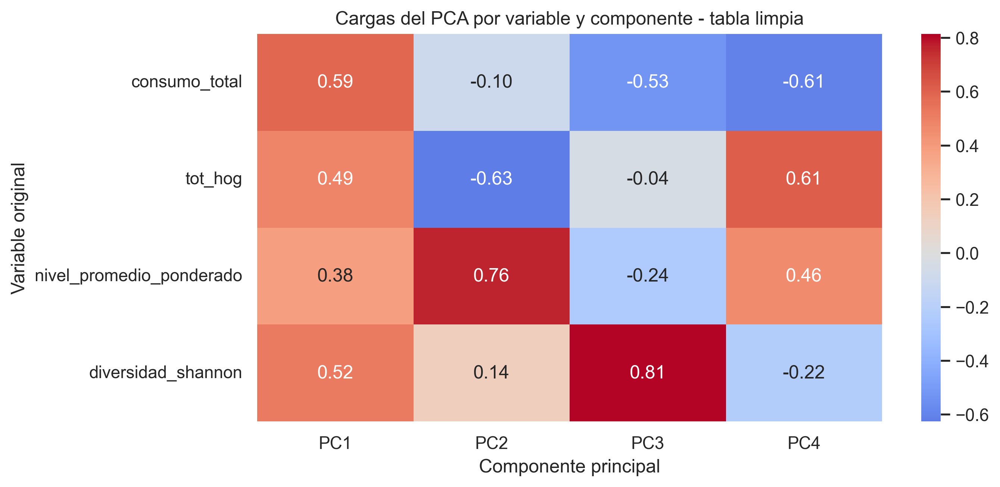
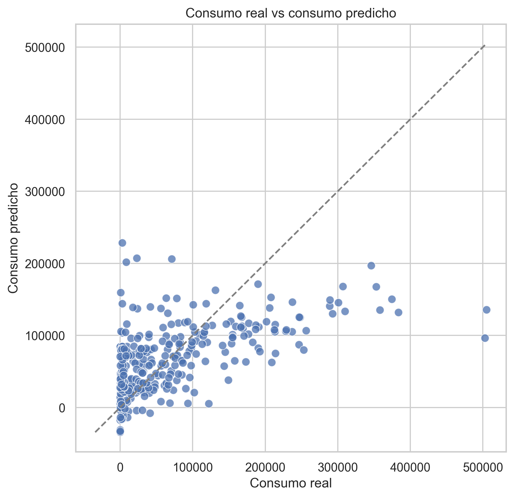
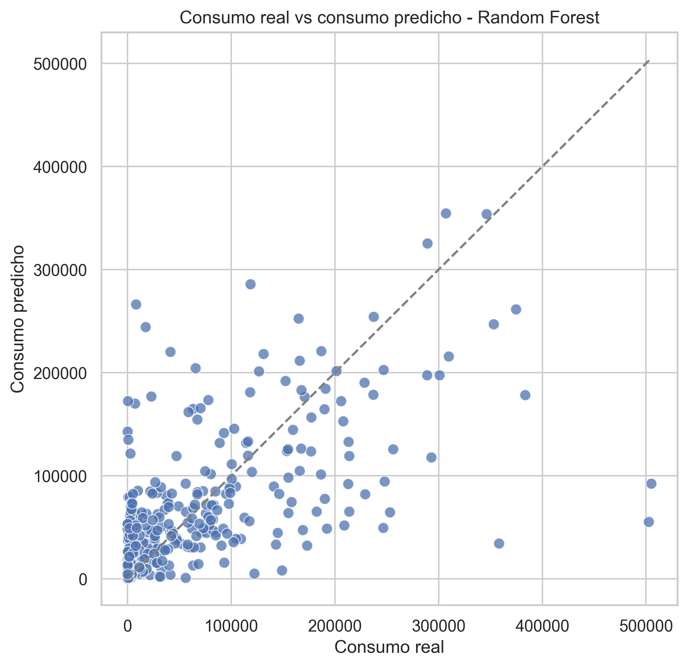
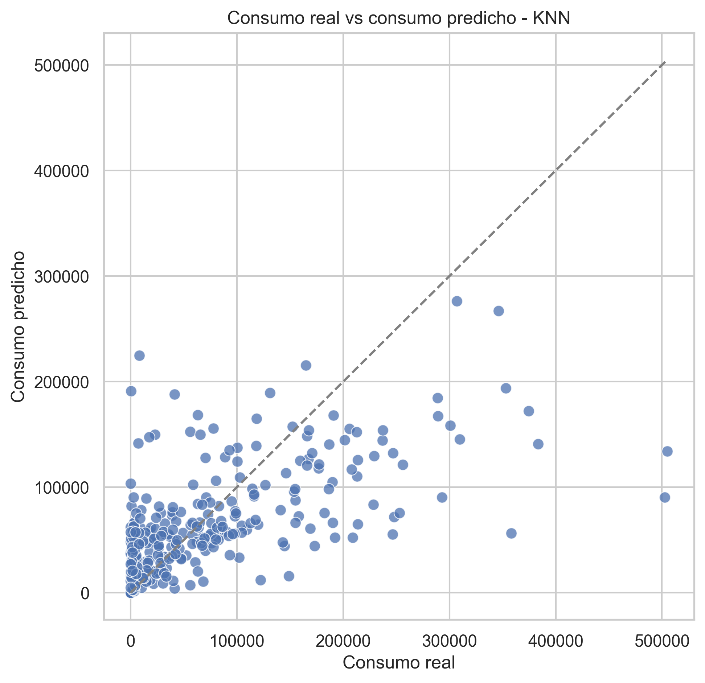

# Agua CDMX

> **Nota metodológica sobre temporalidad de los datos.** El análisis integra datos de consumo de agua correspondientes a **2019** con datos de hogares por colonia correspondientes a **2020**. Aunque no pertenecen exactamente al mismo año calendario, esta diferencia no afecta de manera sustantiva la validez del ejercicio. En este proyecto, `Sum_TotHog` se usa como una variable estructural de carácter demográfico-territorial, por lo que un desfase de un año introduce un error comparativamente pequeño frente a otras fuentes de variación más relevantes, como infraestructura, fugas, actividad económica o heterogeneidad urbana.

## Descripción del problema

La Ciudad de México enfrenta una problemática hídrica compleja en la que el consumo de agua no depende únicamente del tamaño poblacional, sino también de la composición socioeconómica, la estructura territorial y la heterogeneidad interna de cada colonia. En este contexto, el proyecto busca construir una base analítica a escala de colonia que permita resumir y modelar el consumo total de agua a partir de variables relativamente compactas e interpretables.

Además del número de hogares, este análisis incorpora dos indicadores sintetizados a partir de la distribución del consumo por nivel socioeconómico: `nivel_promedio_ponderado` y `diversidad_shannon`. Con estas variables se construye una tabla final por colonia, se aplica un Análisis de Componentes Principales (PCA) para resumir la estructura conjunta de los datos y, finalmente, se comparan tres modelos predictivos para estimar `consumo_total`.

El flujo analítico principal quedó documentado en el notebook [agua_cdmx_pca.ipynb](agua_cdmx_pca.ipynb), que además ahora exporta automáticamente sus visualizaciones a la carpeta [graficas_pca](graficas_pca).

## Tablas de variables por dataset

### 1. Dataset original de consumo histórico de agua

| Variable | Tipo | Uso en el proyecto |
|---|---|---|
| `fecha_referencia` | Fecha | Referencia temporal del consumo observado |
| `anio` | Entero | Identificación anual |
| `bimestre` | Entero | Identificación bimestral previa al colapso |
| `consumo_total` | Numérica | Variable de consumo agregada de interés |
| `indice_des` | Categórica | Nivel socioeconómico asociado al registro |
| `colonia` | Texto | Unidad territorial base |
| `alcaldia` | Texto | Unidad territorial complementaria para llave |

### 2. Dataset territorial de hogares por colonia

| Variable | Tipo | Uso en el proyecto |
|---|---|---|
| `cve_col` | Texto | Clave territorial de apoyo para cruces |
| `colonia` | Texto | Nombre de colonia |
| `alcaldia` | Texto | Nombre de alcaldía |
| `Sum_TotHog` | Numérica | Total de hogares por colonia |
| `Area_ha` | Numérica | Variable territorial disponible, no usada en esta versión |
| `DenViv20` | Numérica | Densidad de vivienda disponible, no usada en esta versión |

### 3. Dataset final para PCA y modelado

| Variable | Tipo | Interpretación |
|---|---|---|
| `colonia_alcaldia` | Texto | Identificador único por colonia y alcaldía |
| `consumo_total` | Numérica | Consumo total agregado por colonia |
| `tot_hog` | Numérica | Total de hogares por colonia |
| `nivel_promedio_ponderado` | Numérica | Resume la composición socioeconómica dominante |
| `diversidad_shannon` | Numérica | Mide heterogeneidad socioeconómica interna |
| `PC1`, `PC2`, `PC3`, `PC4` | Numéricas | Componentes principales derivados del PCA |

La tabla limpia final usada para modelado contiene **1,512 colonias**, de las cuales sólo **2** presentan `NaN` en `tot_hog`.

## Resultados del análisis exploratorio

### 1. Scree plot del PCA sobre la tabla final

El PCA aplicado sobre la tabla final muestra que la variación no se concentra en un solo eje. `PC1` explica aproximadamente **40%** de la varianza total y `PC2` alrededor de **26%**, de modo que los dos primeros componentes resumen cerca de **66%** de la información. Al incorporar `PC3`, la varianza acumulada sube a **85%**, lo que sugiere que tres componentes bastan para representar de forma razonable la estructura general del conjunto.

### 2. Proyección de colonias en `PC1` y `PC2`

La proyección en el plano `PC1`-`PC2` permite observar un núcleo amplio de colonias con perfiles relativamente similares y algunos casos claramente alejados del resto. Esto confirma que la base combina un patrón central relativamente estable con observaciones más extremas que conviene revisar antes del modelado.

### 3. Cargas del PCA sobre la tabla final

Las cargas del PCA muestran cómo se combinan `consumo_total`, `tot_hog`, `nivel_promedio_ponderado` y `diversidad_shannon` dentro de cada componente. En términos sustantivos, los componentes no reflejan una sola variable aislada, sino combinaciones distintas entre tamaño de colonia, intensidad de consumo y composición socioeconómica.

### 4. Revisión y limpieza de outliers

A partir de reglas IQR y umbrales sustantivos se identificaron observaciones especialmente extremas. En esta etapa se eliminaron **41 colonias**, pasando de **1,553** observaciones iniciales a una `tabla_limpia` de **1,512** colonias. Esta depuración buscó reducir la influencia desproporcionada de casos atípicos sobre el PCA y sobre los modelos predictivos.

### 5. Scree plot del PCA sobre la tabla limpia

Después de retirar outliers notorios, el PCA gana algo de capacidad de síntesis. `PC1` explica aproximadamente **46%** de la varianza y `PC2` cerca de **26%**, por lo que los dos primeros componentes concentran ya alrededor de **71%** de la información total. Con tres componentes, la varianza acumulada alcanza cerca de **89%**, lo que sugiere una estructura más estable y más concentrada que en la tabla original.

### 6. Proyección y cargas del PCA sobre la tabla limpia

Las visualizaciones sobre la tabla limpia confirman que el patrón global se conserva, pero con menos distorsión causada por casos extremos. Esto vuelve más interpretable la estructura de similitudes entre colonias y más consistente la lectura de las cargas por componente.

## Modelo estadístico con hallazgos

Con la tabla limpia se compararon tres modelos para predecir `consumo_total` usando como variables predictoras `tot_hog`, `nivel_promedio_ponderado` y `diversidad_shannon`:

- `LinearRegression` como línea base interpretable.
- `RandomForestRegressor` para capturar relaciones no lineales e interacciones.
- `KNeighborsRegressor` para explotar similitudes locales entre colonias.

### Métricas comparadas

| Métrica | Regresión lineal | Random Forest | KNN |
|---|---:|---:|---:|
| `R2` | 0.31 | 0.32 | **0.37** |
| `MAE` | 51,677.86 | 46,786.76 | **46,374.53** |
| `RMSE` | 74,572.61 | 73,975.26 | **71,208.84** |

### Visualización de predicción por modelo

#### Regresión lineal

La regresión lineal funciona como un punto de partida claro, pero deja ver una dispersión amplia entre valores observados y predichos. Esto indica que la relación entre las variables seleccionadas y el consumo no puede resumirse bien con una forma estrictamente lineal.

#### Random Forest

El Random Forest mejora ligeramente frente a la regresión lineal, lo que sugiere que sí hay cierta no linealidad en el problema. Sin embargo, la ganancia es moderada, probablemente porque el número de variables disponibles sigue siendo pequeño.

#### KNeighborsRegressor

El mejor desempeño lo obtuvo `KNeighborsRegressor`, con el mayor `R2` y los menores errores absolutos y cuadráticos. Esto sugiere que, con las variables seleccionadas, el consumo de agua se explica mejor por similitudes locales entre colonias parecidas que por una relación lineal global única.

En términos metodológicos, el hallazgo más importante es que las variables sintetizadas mediante *socioeconomic features* sí aportan señal predictiva adicional frente a usar solamente hogares. Aun así, el valor de `R2 = 0.37` indica que una parte importante de la variación del consumo sigue sin ser explicada, por lo que la mejora de fondo depende más de incorporar nuevas variables que de seguir ajustando el algoritmo actual.

## Conclusión ejecutiva

El notebook `agua_cdmx_pca.ipynb` permitió pasar de una base de consumo desagregada por bimestre y nivel socioeconómico a una tabla final compacta por colonia, enriquecida con indicadores socioeconómicos sintéticos y componentes principales. Este proceso hizo posible resumir mejor la estructura territorial del consumo y comparar modelos de predicción con una base más robusta.

Los resultados muestran que la combinación de `tot_hog`, `nivel_promedio_ponderado` y `diversidad_shannon` contiene señal útil para predecir `consumo_total`, pero no suficiente para explicar por completo el fenómeno. Entre los modelos probados, **KNN** fue el mejor con las variables actuales, lo que sugiere que el consumo de agua responde a patrones de similitud territorial más complejos que una simple relación lineal.

La principal implicación analítica es que el proyecto ya cuenta con una base sólida para una segunda etapa. El siguiente salto en desempeño probablemente no vendrá sólo de cambiar de algoritmo, sino de agregar variables sobre densidad, uso de suelo, actividad económica, infraestructura hidráulica, fugas, clima y características territoriales más finas.

## Referencias

BBC News Mundo. (2024, 11 de marzo). *Agua en CDMX: ¿qué hay de cierto en que Ciudad de México podría quedarse sin agua y llegar a su “día cero”?* BBC. https://news.google.com/rss/articles/CBMiW0FVX3lxTE5YVkpKNDdCVFFmTy1YSXYyZkRZX3RGaVEyYU1NaEJGakx1NmNPRFBRZFJiSWF6ck1ObWhhYXJGMHMyV08yT1JUN1dVeHV4ZGJGcVg4cGpRNDZlWU3SAWBBVV95cUxQNXkzODZiTjVZa3QtemtWbl9ETHg3YkVfRXRXMUxsSm5xdXVSb1pteE1CbWMxcGNBbU1uSHoyM2l4OW4xazh0Y0RnZE9WQTVZdlhOQkFwbEhENWV2UXB1ZnI?oc=5

CNN en Español. (2024, 22 de marzo). *ANÁLISIS | ¿Es posible acabar con la crisis del agua en la Ciudad de México?* CNN en Español. https://news.google.com/rss/articles/CBMikAFBVV95cUxQOTNSZEtMVHplb2kyMVBMWEIySlJkQ3NIUERKNkZXcEtsWjVGa0FReThUZVhDSUU1OUNxZWRUZHh5MlNwQTRBQW1PbzQzQkR6dmpmN1AtaFI3TVhMMGFKeDVQWm9TdDZ5amNDWHc3MjBoc0RiQUR0bkFsYmZHVXpWYVZaTkhNT3p1T1ZzRzd4WE4?oc=5

El País. (2024, 16 de junio). *La crisis del agua lleva al límite a Ciudad de México.* El País. https://news.google.com/rss/articles/CBMimwFBVV95cUxPZjRxY1BiSUN1TGtVaVMzQmFSYnB5X3VHb2NDM09BYmlZY2hZd3dicno4RDgxNnNmalFjNlZ6MDNBYU1XUWl2RmFpQWhpVXBUbnA0SVZ6SVVGSkNOelRxVXRXRnFPcTNlNi1tQ1NrY0tXTHF2U1l6RFVKcVhtbTBZLWZta1FUN2dHOERLcEJJRGU4eEE2RlYtcG96MNIBrwFBVV95cUxOTjI1WmdMdVpoRDBHa2JWMWlwRGYtUU81cUpVZjlQaUFHc202Nk1YU3RqeDktNXpFZ283U254VXdfVURvejVaR1FLcGVMdkRFNFdfZkF1R291aGpiTUdubmlJWG1WdGl3UDNraW9Rb0NBNDNwQjdTRGcycE5URzU4bVdnMHhrWnJhby16cnpVcGRTUkRBX2VCSTFKZjc2U0ZMWXEwRGxVamNrRExuNXJv?oc=5
