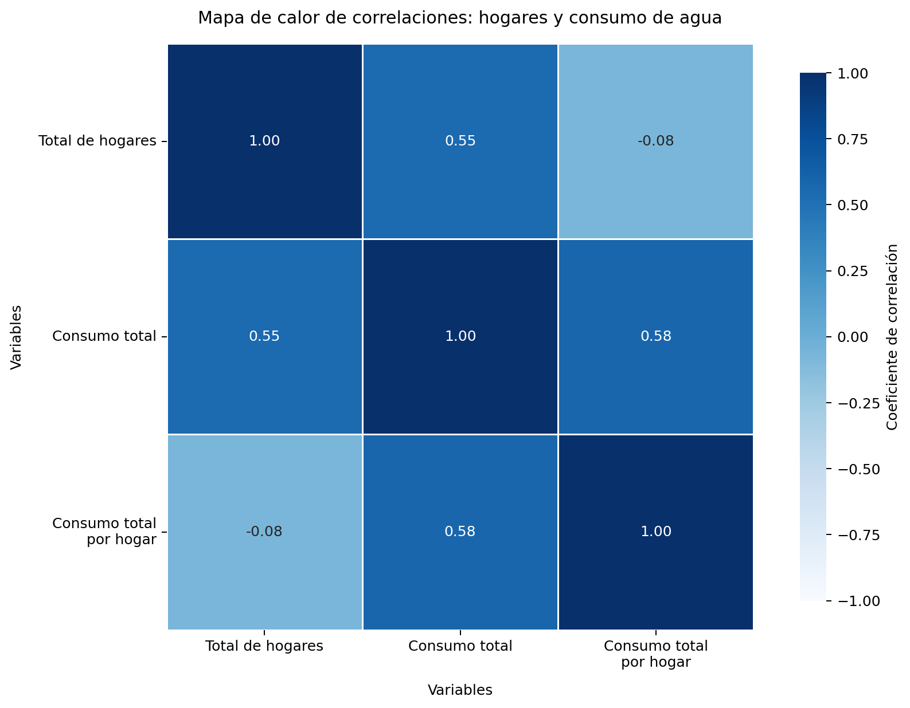
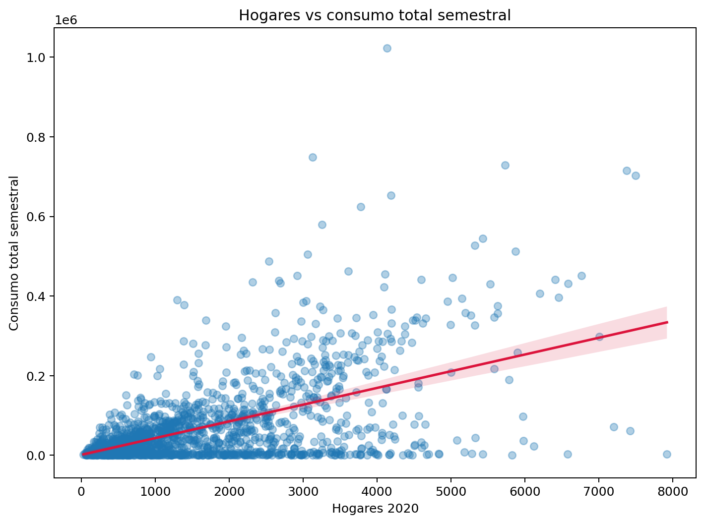
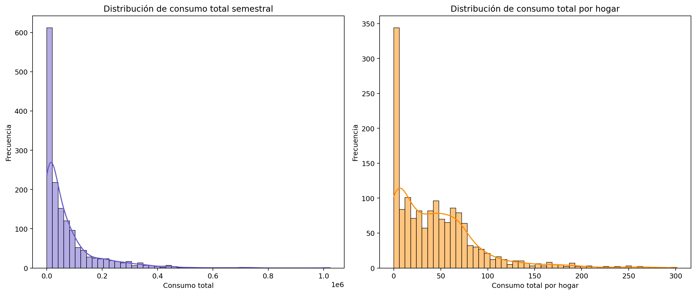
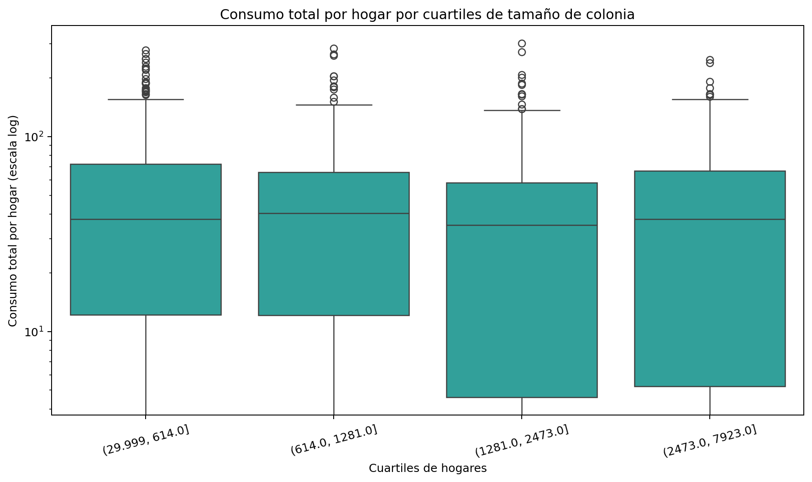
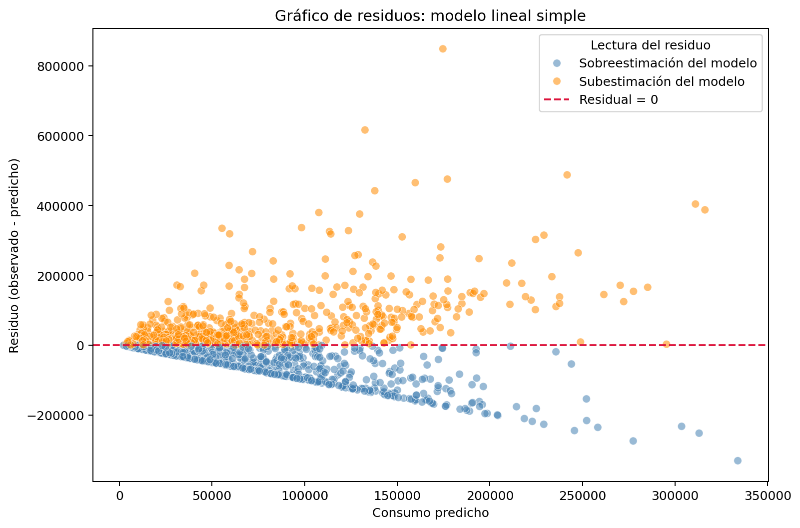
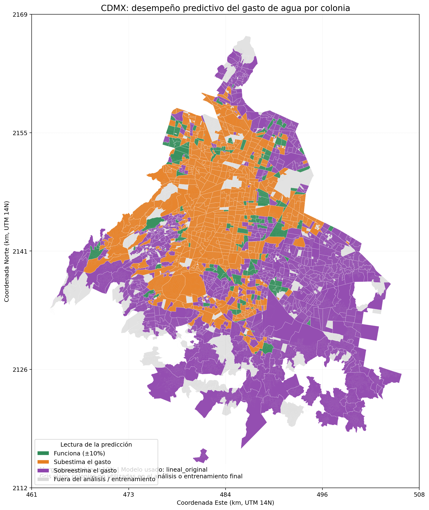

# Agua CDMX

> **Nota metodológica sobre temporalidad de los datos.** El análisis integra datos de consumo de agua correspondientes a **2019** con datos de hogares por colonia correspondientes a **2020**. Aunque no pertenecen exactamente al mismo año calendario, esta diferencia no afecta de manera sustantiva la validez del ejercicio. La razón es que `Sum_TotHog` funciona aquí como una variable estructural de orden demográfico-territorial, no como una medida altamente volátil en el corto plazo. En un horizonte de un año, la distribución espacial de hogares por colonia en la CDMX tiende a cambiar de forma gradual y no abrupta, por lo que el error introducido por este desfase temporal es, para fines analíticos, **despreciable** frente a otras fuentes de variación mucho más relevantes, como la heterogeneidad en usos del suelo, infraestructura, fugas o patrones de consumo. En otras palabras, el desfase existe y debe transparentarse, pero no altera la lectura principal del modelo ni invalida la comparación territorial planteada.

## Descripción del problema

La Ciudad de México enfrenta una problemática hídrica compleja que combina presión demográfica, desigualdad territorial, infraestructura envejecida, fugas, variación en patrones de consumo y vulnerabilidad en las fuentes de abastecimiento. Durante 2024, la discusión pública sobre la crisis del agua se intensificó por los niveles críticamente bajos del Sistema Cutzamala, el temor al llamado “día cero” y la evidencia de que el acceso al agua no se distribuye de manera homogénea en toda la ciudad. En este contexto, entender cómo se comporta el consumo de agua a escala territorial no es sólo un ejercicio técnico o académico, sino una pregunta relevante para la planeación urbana, la gestión pública y la toma de decisiones basada en datos.

Este proyecto parte de una pregunta concreta: **¿es posible predecir el gasto total de agua por colonia utilizando únicamente el número de hogares de esa colonia?** La pregunta es metodológicamente útil porque pone a prueba el alcance de una variable simple, accesible y fácilmente interpretable. Si el número de hogares explicara de manera razonable el consumo total, podría funcionar como una base preliminar para estimaciones rápidas de demanda. Sin embargo, si su capacidad explicativa resulta limitada, entonces quedaría claro que el fenómeno depende también de otros factores, como la mezcla de usos del suelo, la densidad construida, el nivel socioeconómico, la actividad comercial, las fugas o las diferencias de infraestructura entre zonas.

Para responder esta pregunta, el análisis integra datos abiertos de consumo histórico de agua con información territorial de hogares por colonia en la CDMX. A partir de esa integración, se construye una base analítica comparable a nivel colonia-semestre, que permite realizar limpieza, exploración estadística, visualización y modelado. El objetivo no es solamente ajustar una regresión, sino evaluar con rigor hasta dónde puede llegar una explicación basada en una sola variable y qué tan útil resulta como aproximación inicial frente a un problema urbano mucho más heterogéneo de lo que una relación lineal simple podría capturar.

## Tablas de variables por dataset

### 1. Dataset original de consumo histórico de agua

| Variable | Tipo | Rango / valores observados | Valores faltantes |
|---|---|---|---:|
| `fecha_referencia` | object | 3 valores; ej.: 2019-06-30, 2019-02-28, 2019-04-30 | 0 |
| `anio` | int64 | 2019.0000 a 2019.0000 | 0 |
| `bimestre` | int64 | 1.0000 a 3.0000 | 0 |
| `consumo_total` | float64 | 0.0000 a 119,726.9400 | 0 |
| `consumo_total_dom` | float64 | 0.0000 a 95,060.6900 | 4820 |
| `consumo_total_no_dom` | float64 | 0.0000 a 119,726.9400 | 0 |
| `indice_des` | object | 4 valores; ej.: ALTO, MEDIO, POPULAR | 0 |
| `colonia` | object | 1494 valores; ej.: 7 DE NOVIEMBRE, GERTRUDIS SANCHEZ 3A SECCION, PRO HOGAR I | 216 |
| `alcaldia` | object | 16 valores; ej.: GUSTAVO A. MADERO, AZCAPOTZALCO, COYOACAN | 216 |
| `latitud` | float64 | 19.1359 a 19.5791 | 0 |
| `longitud` | float64 | -99.3377 a -98.9505 | 0 |

> Nota: esta tabla resume las variables centrales del archivo fuente utilizadas para la integración, limpieza y análisis posterior.

### 2. Dataset territorial de hogares por colonia

| Variable | Tipo | Rango / valores observados | Valores faltantes |
|---|---|---|---:|
| `FID_1` | int64 | 0.0000 a 1,813.0000 | 0 |
| `cve_ent` | object | 1 valores; ej.: 09 | 0 |
| `alcaldia` | object | 16 valores; ej.: AZCAPOTZALCO, BENITO JUAREZ, GUSTAVO A. MADERO | 0 |
| `cve_col` | object | 1814 valores; ej.: 02-001, 02-002, 02-005 | 0 |
| `colonia` | object | 1743 valores; ej.: AGUILERA, ALDANA, ANGEL ZIMBRON | 0 |
| `VivHab2010` | int64 | 0.0000 a 7,066.0000 | 0 |
| `VivHab2020` | int64 | 0.0000 a 8,041.0000 | 0 |
| `Area_ha` | float64 | 0.1414 a 1,185.7193 | 0 |
| `DenViv10` | float64 | 0.0000 a 419.1327 | 0 |
| `DenViv20` | float64 | 0.0000 a 554.4223 | 0 |
| `Sum_TotHog` | float64 | 0.0000 a 104,459.0000 | 0 |

### 3. Dataset semestral filtrado para análisis y modelado

| Variable | Tipo | Rango / valores observados | Valores faltantes |
|---|---|---|---:|
| `alcaldia` | object | 16 valores; ej.: ALVARO OBREGON, AZCAPOTZALCO, BENITO JUAREZ | 0 |
| `colonia` | object | 1467 valores; ej.: 19 DE MAYO, 1RA VICTORIA, 1RA VICTORIA SECCION BOSQUES | 0 |
| `cve_col` | object | 1519 valores; ej.: 10-241, 10-242, 10-243 | 0 |
| `Sum_TotHog` | float64 | 30.0000 a 7,923.0000 | 0 |
| `consumo_total` | float64 | 0.0000 a 1,023,105.0200 | 0 |

## Resultados del análisis exploratorio

A partir de la base semestral ya limpia, el análisis exploratorio se concentró en entender la relación entre el tamaño de la colonia, medido por el número de hogares, y el consumo total de agua. Para ello se usaron múltiples visualizaciones que permiten observar correlaciones, tendencias generales, forma de las distribuciones, diferencias entre grupos y zonas donde el modelo falla con mayor claridad. A continuación se resumen cinco visualizaciones clave con su interpretación.

### 1. Mapa de calor de correlaciones

El mapa de calor de correlaciones muestra una asociación positiva clara entre `Sum_TotHog` y `consumo_total`, lo que confirma que las colonias con más hogares tienden a concentrar una mayor demanda agregada de agua. Sin embargo, la lectura más fina aparece cuando se incorpora `consumo_total_por_hogar_sem`: la correlación con el número de hogares es considerablemente menor, lo que sugiere que el tamaño poblacional no explica por sí solo la intensidad del consumo. Esta diferencia es importante porque separa dos fenómenos distintos: una cosa es que una colonia grande consuma más agua en total, y otra es que cada hogar dentro de esa colonia consuma sistemáticamente más. En términos sustantivos, la matriz sugiere que el número de hogares sí contiene señal útil para predecir volumen agregado, pero también deja ver que la demanda hídrica depende de otras condiciones territoriales y socioeconómicas que no quedan capturadas por una sola variable demográfica.

### 2. Diagrama de dispersión: hogares vs. consumo total

El diagrama de dispersión entre hogares y consumo total muestra una relación positiva general: conforme aumenta el tamaño de la colonia, también tiende a aumentar el volumen agregado de agua consumido. No obstante, la nube de puntos evidencia una dispersión importante alrededor de esa tendencia. Colonias con cantidades similares de hogares pueden registrar niveles muy distintos de consumo total, lo que revela heterogeneidad territorial y posibles diferencias en mezcla de usos, infraestructura, actividad económica o hábitos de consumo. La línea de tendencia permite visualizar la dirección promedio del vínculo, pero no elimina la variabilidad entre observaciones. Esa tensión entre patrón general y dispersión local es una de las conclusiones más importantes del análisis exploratorio: el tamaño de la colonia ayuda a anticipar la dirección del consumo, pero no ofrece una explicación exhaustiva. En otras palabras, la visualización respalda la idea de que existe señal predictiva, aunque todavía insuficiente para estimaciones finas por sí sola.

### 3. Histogramas de consumo total y consumo total por hogar

Las distribuciones de `consumo_total` y `consumo_total_por_hogar_sem` muestran una forma asimétrica a la derecha. La mayor parte de las colonias se concentra en niveles relativamente bajos o medios, mientras que un grupo mucho menor alcanza valores considerablemente más altos. Esta asimetría sugiere que el fenómeno no está repartido de manera uniforme y que existen colonias cuyo comportamiento de consumo se aparta con fuerza del resto. La comparación entre ambas distribuciones también ayuda a distinguir entre volumen agregado e intensidad relativa. Mientras el consumo total refleja el tamaño general de la demanda territorial, el consumo por hogar permite ver si ciertas colonias destacan incluso después de ajustar por tamaño. Analíticamente, esto justifica la identificación de casos extremos y la depuración previa al modelado, ya que una pequeña cantidad de observaciones muy altas puede deformar tanto la lectura visual como los coeficientes de un modelo simple si no se tratan con cuidado.

### 4. Diagrama de caja por cuartiles de hogares

El boxplot por cuartiles de hogares permite comparar cómo se distribuye el consumo total por hogar entre colonias pequeñas, medianas y grandes. La visualización muestra que la mediana y la dispersión cambian entre grupos, lo que sugiere que la intensidad del consumo no es idéntica a lo largo del continuo de tamaño poblacional. Además, la presencia de puntos extremos dentro de varios cuartiles confirma que no sólo existen diferencias entre grupos, sino también heterogeneidad interna dentro de cada segmento. Esto es relevante porque impide asumir que todas las colonias con tamaños parecidos comparten un mismo patrón de consumo por hogar. La escala logarítmica ayuda a que la comparación sea legible pese a la amplitud de los valores observados. En términos interpretativos, el boxplot refuerza la conclusión de que el número de hogares aporta información valiosa, pero no basta para describir completamente la intensidad del consumo; incluso entre colonias de tamaños semejantes persisten diferencias que exigen variables adicionales para una explicación más robusta.

### 5. Gráfico de residuos del modelo lineal simple

El gráfico de residuos permite observar con claridad dónde falla más el modelo una vez ajustada la regresión lineal simple. Los puntos por encima de cero representan colonias cuyo consumo observado fue mayor al predicho, es decir, casos en los que el modelo subestima el gasto; los puntos por debajo muestran colonias cuyo consumo fue sobreestimado. Si el ajuste fuera muy bueno, los residuos se distribuirían de forma relativamente compacta alrededor de cero. En cambio, la visualización deja ver una dispersión amplia y patrones de error que no desaparecen en distintos niveles de consumo predicho. Esto indica que el modelo captura una parte de la señal, pero deja una fracción importante sin explicar. La lectura sustantiva es clara: el número de hogares sí funciona como predictor base, pero no agota los determinantes del consumo de agua por colonia. Por tanto, el gráfico de residuos no sólo sirve como diagnóstico estadístico, sino también como evidencia de los límites analíticos del modelo con una sola variable.

### 6. Mapa de desempeño predictivo por colonia en la CDMX

El mapa de desempeño predictivo agrega una lectura territorial al análisis y permite identificar en qué colonias el modelo lineal se acerca razonablemente al consumo observado y en cuáles falla por sobreestimación o subestimación. Las colonias en verde representan casos donde la predicción cae dentro de un margen de ±10%, mientras que los tonos naranja y morado muestran desviaciones sistemáticas por debajo o por encima de lo observado. La presencia de zonas grises indica colonias que no fueron incorporadas en el análisis o entrenamiento final, ya sea por exclusión metodológica o porque quedaron fuera de la base depurada. Esta visualización es valiosa porque evidencia que el error del modelo no se distribuye de forma homogénea en la ciudad: hay territorios donde la relación entre hogares y consumo se ajusta mejor al patrón promedio y otros donde factores no observados alteran con más fuerza la predicción. En términos analíticos, el mapa refuerza la idea de que el tamaño de la colonia ayuda a aproximar la demanda, pero no basta para capturar toda la heterogeneidad hídrica de la CDMX.

## Modelo estadístico con hallazgos

Para responder la pregunta central del proyecto se estimó una **regresión lineal simple** en la que `consumo_total` se modela como función de `Sum_TotHog`. El objetivo fue evaluar si el número de hogares por colonia permite explicar y predecir el gasto total semestral de agua con un nivel razonable de precisión. Sobre la base analítica limpia, el modelo arrojó un **intercepto de 1,934.56** y una **pendiente de 41.82**, lo que implica que, en promedio, cada hogar adicional se asocia con un aumento estimado de 41.82 unidades en el consumo total semestral. Esta relación tiene el signo esperado y confirma que existe una conexión positiva entre tamaño demográfico y volumen agregado de consumo.

### Métricas principales del modelo lineal

| Métrica | Valor |
|---|---:|
| Intercepto | 1,934.56 |
| Pendiente (`Sum_TotHog`) | 41.82 |
| R² | 0.2957 |
| RMSE | 87,121.04 |
| MAE | 54,670.76 |
| Observaciones usadas | 1,494 |

El valor de **R² = 0.2957** indica que el modelo explica alrededor del 29.6% de la variación observada en el consumo total. Esto significa que el número de hogares sí aporta señal estadística relevante, pero también que más de dos terceras partes de la variación permanecen sin explicar bajo esta especificación. Las métricas de error, en particular RMSE y MAE, muestran que las desviaciones entre valores observados y predichos siguen siendo amplias. Por eso, el hallazgo correcto no es afirmar que el modelo “predice bien” en términos absolutos, sino que funciona como una **aproximación base útil pero limitada**.

### Comparación con el modelo log-log

Además del modelo lineal en escala original, se probó una especificación **log-log** para explorar si una relación proporcional entre hogares y consumo mejoraba el desempeño. En esa versión, la pendiente estimada fue de **0.7244** y el **R² logarítmico** fue de **0.1133**. Aunque esta formulación permite una lectura interesante en términos de elasticidad, no superó al modelo lineal cuando se comparó su desempeño fuera de muestra.

| Métrica en test | Modelo lineal | Modelo log-log |
|---|---:|---:|
| RMSE | 75,823.68 | 93,731.35 |
| MAE | 52,499.66 | 55,430.60 |
| R² test | 0.3161 | -0.0451 |

La comparación de prueba sugiere que el **modelo lineal generaliza mejor** que el log-log para esta base ya depurada. El modelo lineal obtiene menor error absoluto, menor error cuadrático medio y un R² positivo en test, mientras que el log-log muestra un R² negativo, señal de que su poder predictivo es peor que usar simplemente el promedio observado. En consecuencia, el hallazgo principal es que `Sum_TotHog` sí puede utilizarse como predictor inicial del consumo total, pero no como explicación suficiente del fenómeno. La heterogeneidad territorial, la mezcla de usos del suelo, las fugas, la infraestructura y otros factores no observados siguen desempeñando un papel importante en la demanda hídrica de la CDMX.

## Conclusión ejecutiva

El análisis muestra que el número de hogares por colonia sí guarda una relación positiva y consistente con el consumo total semestral de agua en la Ciudad de México. En ese sentido, `Sum_TotHog` funciona como una variable base útil para aproximar la demanda agregada: colonias con más hogares tienden, en promedio, a consumir más agua. Sin embargo, tanto el análisis exploratorio como el modelado estadístico indican que esa relación es insuficiente para explicar con precisión el comportamiento completo del consumo. El modelo lineal simple capta señal real, pero sólo explica una parte limitada de la variación observada y mantiene errores amplios en varias colonias.

La comparación entre modelos también refuerza esta conclusión. Aunque se probó una especificación log-log para explorar una relación proporcional, el modelo lineal mostró mejor desempeño fuera de muestra, con menores errores y un mejor ajuste en test. Esto sugiere que, para esta base depurada, el enfoque lineal es más adecuado como línea base predictiva. Aun así, el hallazgo central no es que el modelo lineal “resuelva” el problema, sino que permite delimitar con claridad sus alcances: el tamaño de la colonia importa, pero no agota la explicación del consumo hídrico. Para avanzar hacia predicciones más robustas sería necesario incorporar variables adicionales, como mezcla de usos del suelo, infraestructura, fugas y diferencias socioeconómicas.

## Referencias

BBC News Mundo. (2024, 11 de marzo). *Agua en CDMX: ¿qué hay de cierto en que Ciudad de México podría quedarse sin agua y llegar a su “día cero”?* BBC. https://news.google.com/rss/articles/CBMiW0FVX3lxTE5YVkpKNDdCVFFmTy1YSXYyZkRZX3RGaVEyYU1NaEJGakx1NmNPRFBRZFJiSWF6ck1ObWhhYXJGMHMyV08yT1JUN1dVeHV4ZGJGcVg4cGpRNDZlWU3SAWBBVV95cUxQNXkzODZiTjVZa3QtemtWbl9ETHg3YkVfRXRXMUxsSm5xdXVSb1pteE1CbWMxcGNBbU1uSHoyM2l4OW4xazh0Y0RnZE9WQTVZdlhOQkFwbEhENWV2UXB1ZnI?oc=5

CNN en Español. (2024, 22 de marzo). *ANÁLISIS | ¿Es posible acabar con la crisis del agua en la Ciudad de México?* CNN en Español. https://news.google.com/rss/articles/CBMikAFBVV95cUxQOTNSZEtMVHplb2kyMVBMWEIySlJkQ3NIUERKNkZXcEtsWjVGa0FReThUZVhDSUU1OUNxZWRUZHh5MlNwQTRBQW1PbzQzQkR6dmpmN1AtaFI3TVhMMGFKeDVQWm9TdDZ5amNDWHc3MjBoc0RiQUR0bkFsYmZHVXpWYVZaTkhNT3p1T1ZzRzd4WE4?oc=5

El País. (2024, 16 de junio). *La crisis del agua lleva al límite a Ciudad de México.* El País. https://news.google.com/rss/articles/CBMimwFBVV95cUxPZjRxY1BiSUN1TGtVaVMzQmFSYnB5X3VHb2NDM09BYmlZY2hZd3dicno4RDgxNnNmalFjNlZ6MDNBYU1XUWl2RmFpQWhpVXBUbnA0SVZ6SVVGSkNOelRxVXRXRnFPcTNlNi1tQ1NrY0tXTHF2U1l6RFVKcVhtbTBZLWZta1FUN2dHOERLcEJJRGU4eEE2RlYtcG96MNIBrwFBVV95cUxOTjI1WmdMdVpoRDBHa2JWMWlwRGYtUU81cUpVZjlQaUFHc202Nk1YU3RqeDktNXpFZ283U254VXdfVURvejVaR1FLcGVMdkRFNFdfZkF1R291aGpiTUdubmlJWG1WdGl3UDNraW9Rb0NBNDNwQjdTRGcycE5URzU4bVdnMHhrWnJhby16cnpVcGRTUkRBX2VCSTFKZjc2U0ZMWXEwRGxVamNrRExuNXJv?oc=5
